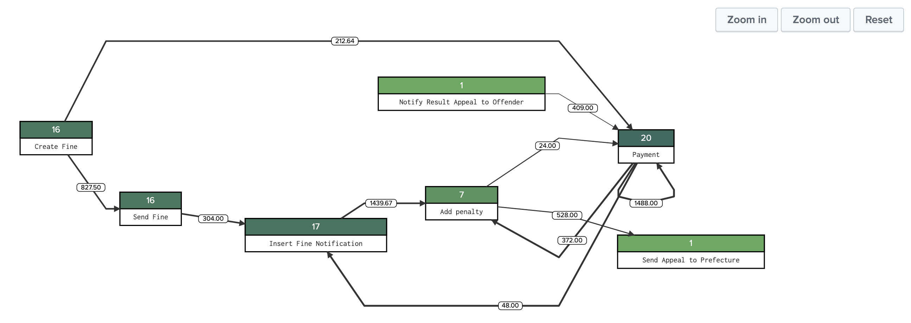

# Process Flow Diagram - Custom Visualization

Modular visualization for process flows and process models models. 
Based on the open source [joint.js](https://jointjs.com) library.

## About the Project

### Build With

* [JointJS](jointjs.com)
* [dagre](https://github.com/dagrejs/dagre)

## Getting Started

### Prerequisites
* A recent version of Splunk Enterprise (8.x)

### Installation

1. Download the most recent version of the app `.tar.gz` bundle from Github Releases
2. Install through Splunk Enterprise UI ("Manage Apps"). In a distributed environment, please install the App in the Search Tier ([Splunk Docs](https://docs.splunk.com/Documentation/AddOns/released/Overview/Wheretoinstall) for details)

## Usage

`<search> | table corrID fromStep toStep fromStepDuration`

Presentation of the graph can be modified using the "Format" menu of the visualization.

### Examples

Example dashboards provided with the app for usage reference. Generally, the modular visualization expects the process data to be supplied in the following format: `| table corrID fromStep toStep fromStepDuration`. This means that the process data needs to be transformed into this edge representation where each row in the results represents a transition instance. Transition instances that belong to the same process instance are grouped by `corrID`.

### Experimental

Depending on the configuration, the visualization is able to accept a graph in [DOT Language](https://en.wikipedia.org/wiki/DOT_(graph_description_language)) as input. This feature is experimental for now and needs to be enabled in the Lab🔬 section of the "Format" menu. Please note that once this is enabled, the visualization will not render with the data format described above but require a single result row containing the full DOT specification of the graph.

## Contributing

Please review [`CONTRIBUTING.md`](CONTRIBUTING.md) for guidance on how to contribute to this repository.

## License
Process Flow Diagram - Custom Visualization is licensed under the Apache License 2.0. Please refer to [`LICENSE.md`](./LICENSE.md) for details.